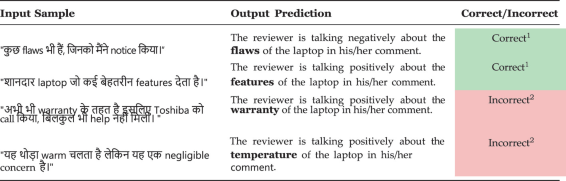

# Aspect-Based-Sentiment-Analysis-on-Code-Mixed-Languages
Official repo of [ICWiCOM 2025](https://www.djsce-icwicom.com/) paper: [Aspect Based Sentiment Analysis on Code Mixed Languages](https://link.springer.com/chapter/10.1007/978-981-95-3616-0_4)

<div align="center">

</div>

## News
- 🚀 [Nov 6, 2025]: We release the code of our ICWiCOM paper. If you have any questions, feel free to open an issue or email 📧 me.
- 🎤 [Nov 1, 2025]: Our paper has been published in the conference proceedings journal of ICWiCOM 2025, available on Springer Nature Link.
- 🎤 [Oct 10, 2025]: We presented our paper at ICWiCOM 2025.
- 🎉 [Jul 17, 2025]: Our paper has been accepted to ICWiCOM 2025!

## Quick Usage Guide

### 1. Environment Setup
First, ensure you're using Python 3.10 or higher. 

Clone the official repository from [Aspect-Based-Sentiment-Analysis-on-Code-Mixed-Languages](https://github.com/AustinKv/Aspect-Based-Sentiment-Analysis-on-Code-Mixed-Languages).

```bash
git clone https://github.com/AustinKv/Aspect-Based-Sentiment-Analysis-on-Code-Mixed-Languages.git
cd Aspect-Based-Sentiment-Analysis-on-Code-Mixed-Languages
```

Create a virtual environment and install libraries
```bash
python -m venv venv
.venv\Scripts\activate
pip install -r requirements.txt
```

### 2. Dataset
We are releasing the datasets used in our experiments.

The dataset is organized into the following folder structure:
```bash
data/
    ├── codemixedlaptopcsv/               # Our Dataset
    │   ├── laptop_dev.csv                # Validation data (Same as Testing data)
    │   ├── laptop_test.csv               # Testing data
    │   ├── laptop_train.csv              # Training data
    ├── semeval2014laptopcsv/             # Sem Eval 2014 Dataset for Laptop Domain converted to CSV format
    │   ├── laptop_dev.csv                # Validation data (Same as Testing data)
    │   ├── laptop_test.csv               # Testing data
    │   ├── laptop_train.csv              # Training data         
    ├── semeval2014laptopxml/             # Sem Eval 2014 Dataset for Laptop Domain in XML format
    │   ├── Laptops_Test_Data_PhaseA.xml  # Testing data
    │   ├── Laptops_Train.xml             # Training data
```

## Acknowledgement
We sincerely thank [ICWiCOM 2025](https://www.djsce-icwicom.com/) for accepting, allowing us to present the paper and finally publish the paper in [Proceedings of International Conference on Wireless Communication Journal](https://link.springer.com/book/10.1007/978-981-95-3616-0)!

We extend our deep gratitude to [Springer Nature Link](https://link.springer.com) and their production partner, [Straive](https://www.straive.com/), for their invaluable assistance in the final publication process. They efficiently handled the typesetting, formatting, cross-referencing, and e-proofing to ensure the paper met the required standards for the Lecture Notes in Electrical Engineering (LNEE) series and subsequent publication on SpringerLink.

Our code used [SemEval 2014 Datasets](https://alt.qcri.org/semeval2014/task4/index.php?id=data-and-tools) as a base of our datasets.

Our code uses the [PyABSA Dataset Preparation Tool](https://github.com/yangheng95/ABSADatasets/tree/v1.2/DPT) to simplify dataset annotation.

## Citation
If you use this code, please cite the following [paper](https://link.springer.com/chapter/10.1007/978-981-95-3616-0_4):

```tex
@inproceedings{kurian2025aspect,
  title={Aspect Based Sentiment Analysis on Code Mixed Languages},
  author={Kurian, Austin and Sharma, Ayush and Kubal, Raj and Phadke, Gargi and Das, Siuli},
  booktitle={International Conference on Wireless Communication},
  pages={33--42},
  year={2025},
  organization={Springer}
}
```

## Project Status & Future Work
Due to time constraints and the early publication timeline, the initial paper and associated code primarily focus on the Aspect Term Extraction task. We acknowledge that the initial results are modest, and the project is still under active development.

Please consider starring this repository to stay up-to-date on all future updates!

Upcoming Updates will Include:


Improved Codebase - Better-structured and optimized code.

Aspect Sentiment Classification - Implementation and results for the complete ABSA (ATE + ASC) task (identifying the sentiment polarity for the extracted aspects).

Live Demo/API: A public-facing mechanism (API, web interface, or similar) to easily test the model with your own code-mixed sentences.

Thank you for your understanding as we continue to refine and expand this project and even write and publish another paper on the complete work.